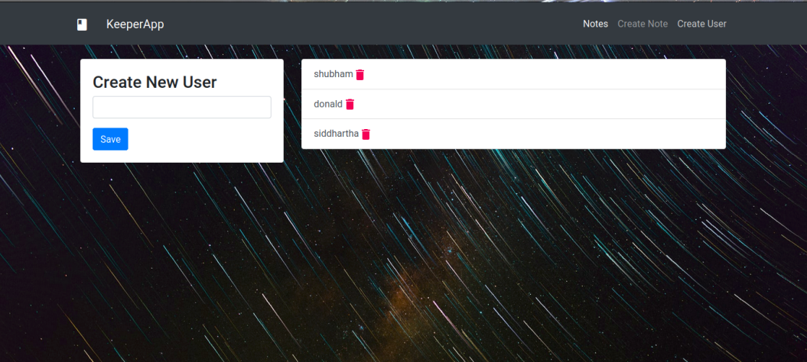
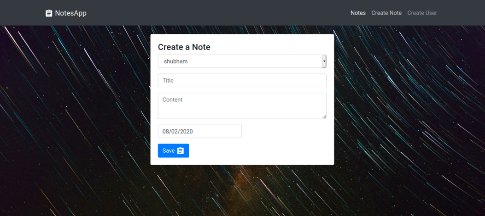

## KEEPER APP
A Full Stack MERN website KeeperAPP for user to store notes or data. Its a simple Web App template that can be used in website development.

<small> This project will be hosted soon</small>
<h2> Installation </h2>

Use the package manager [npm](https://www.npmjs.com/) to in stall Keeper_App.
Setup the project and install the packages by running:
### `npm install`

After setting up the project, run the project using:
### `npm start` `or`  `yarn start`

<h2> Build With </h2>
<ul>
  <li>FrontEnd: <b> React.JS, Bootstrap, HTML/CSS </b></li>
  <li>Backend:  <b> Node.JS, Express.JS </b> </li>
  <li>Database: <b> MongoDB, Mongoose </b> </li>
</ul>

<h2> API </h2>
<h4> Users </h4>
<ul>
  <li> <b>GET</b> /api/users/ </li>
  <li> <b>POST</b> /api/users/ </li>
  <li> <b>PUT</b>  /api/users/:id </li>
  <li> <b>DELETE</b>  /api/users/:id </li>
</ul>

<h4> Users </h4>
<ul>
  <li> <b>GET</b> /api/notes/ </li>
  <li> <b>POST</b> /api/notes/ </li>
  <li> <b>PUT</b>  /api/notes/:id </li>
  <li> <b>DELETE</b>  /api/notes/:id </li>
</ul>

Server runs on `http://localhost:4000`
